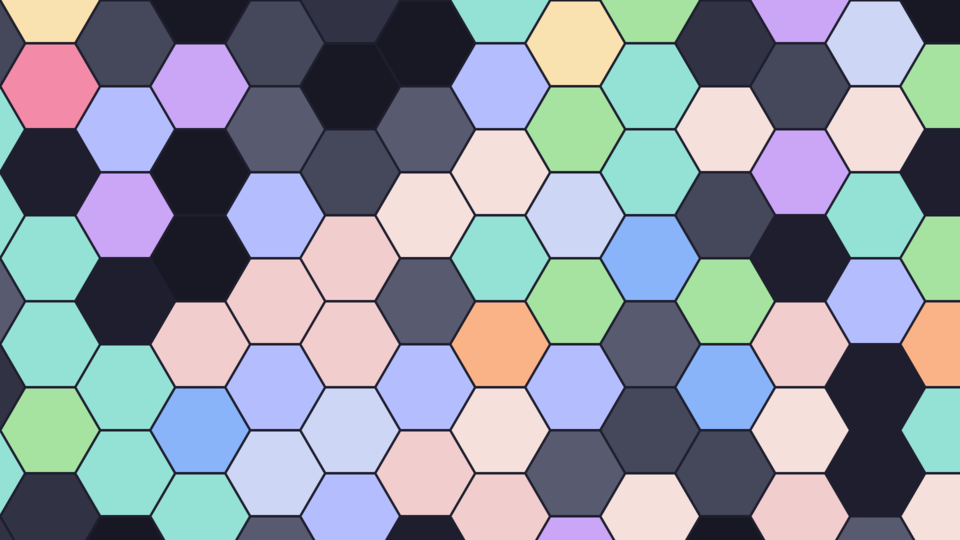
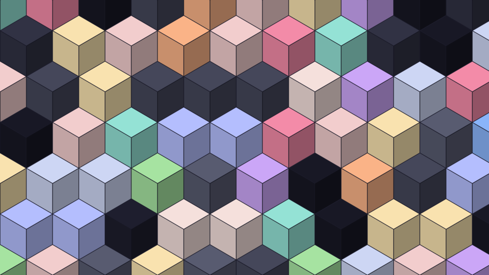
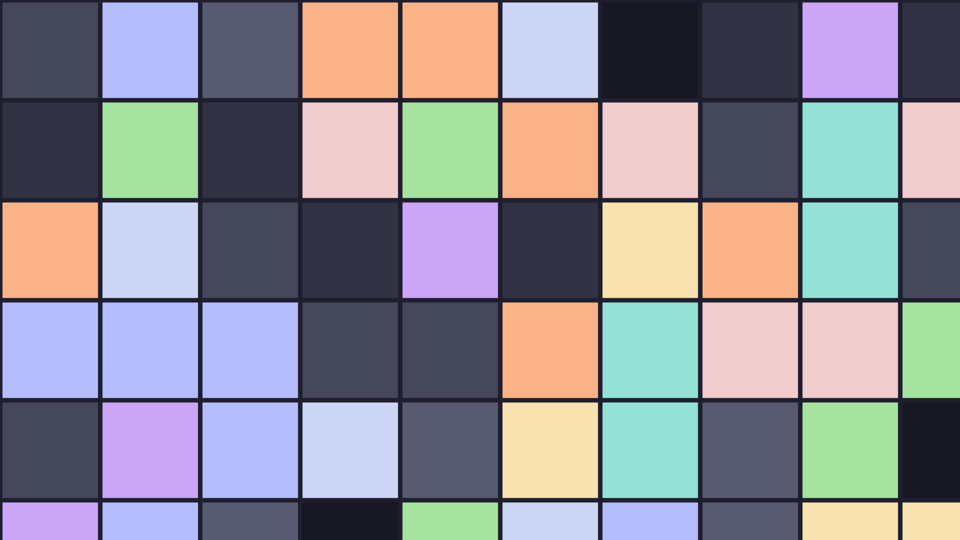
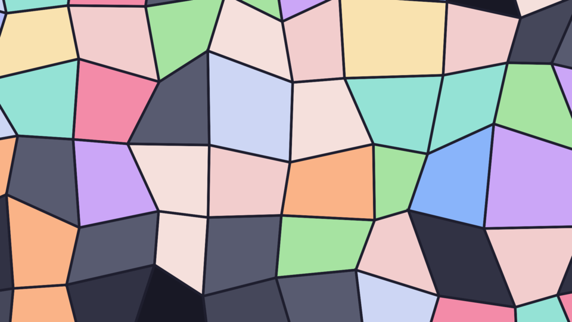

<!-- markdownlint-disable MD013 -->

# magickpaper

A small shell tool that generates procedural wallpapers with ImageMagick. Pick a style, pick a palette, get a PNG. No design software, no manual layer wrangling — just a script you can drop into a rotation, a rice setup, or a cron job.

Many of the styles are inspired by the wallpaper collection at [huedini.io](https://www.huedini.io).

## Preview

|                                                      |                                                    |                                                    |
| ---------------------------------------------------- | -------------------------------------------------- | -------------------------------------------------- |
|          |  |  |
| `bokeh-circles`                                      | `concentric-rings`                                 | `diagonal-stripes`                                 |
|  |    |          |
| `hexagon-honeycomb`                                  | `isometric-cubes`                                  | `mosaic-tiles`                                     |
|                |          |        |
| `polka-dots`                                         | `radial-burst`                                     | `stained-glass`                                    |
|                      |                        |                                                    |
| `stripes`                                            | `waves`                                            |                                                    |

All previews in this README are generated at 960x540 with the default `catppuccin-mocha` palette.

## Requirements

- [ImageMagick](https://imagemagick.org/) (the `magick` command must be on your `PATH`)
- Bash

That's it for actually generating a wallpaper. If you want to sync palettes or regenerate previews, see [Development](#development) below.

## Usage

```sh
./magickpaper.sh -s <style> -p <palette> -w <width> -h <height> -o <output.png>
```

### Options

| Flag | Description                                                                | Default            |
| ---- | -------------------------------------------------------------------------- | ------------------ |
| `-s` | Style name, matching a file in `styles/` (without the `.sh` extension)     | `stripes`          |
| `-p` | Palette name, matching a file in `palettes/` (without the `.sh` extension) | `catppuccin-mocha` |
| `-w` | Target width, in pixels                                                    | `3840`             |
| `-h` | Target height, in pixels                                                   | `2160`             |
| `-o` | Output file path                                                           | `wallpaper.png`    |
| `-c` | Space-separated list of custom hex colors, overrides `-p`                  | —                  |

Internally the image is rendered at a higher resolution than requested and scaled down, which gives cleaner edges and softer gradients than rendering directly at the target size.

### Examples

Generate a 4K wallpaper using the `waves` style and the default palette:

```sh
./magickpaper.sh -s waves -o wallpaper.png
```

Use a specific palette:

```sh
./magickpaper.sh -s hexagon-honeycomb -p gruvbox-dark-hard -o wallpaper.png
```

Skip palette files entirely and pass your own colors:

```sh
./magickpaper.sh -s stripes -c "#1e1e2e #313244 #cdd6da #f38ba8" -o wallpaper.png
```

## Styles

Styles live in `styles/*.sh` and are plain shell scripts sourced by `magickpaper.sh`. Each one has access to the resolved `COLORS` array, `WIDTH`, `HEIGHT`, `OUTPUT_FILE`, and the `get_palette_expr` / `get_clut_expr` helpers for building ImageMagick expressions. Adding a new style is just adding a new file to that directory — no registration step needed, the script picks it up automatically as long as the filename (minus `.sh`) matches what's passed to `-s`.

## Palettes

Palettes live in `palettes/*.sh` and are sourced to populate `base00`–`base0F` before a style runs. They follow the [base16](https://github.com/tinted-theming/base16-schemes) naming scheme, so any base16-compatible color scheme can be dropped in here in the same format.

Rather than maintaining these by hand, this repo pulls them straight from [tinted-theming/schemes](https://github.com/tinted-theming/schemes) and reformats them into shell-sourceable files. If you're inside the `devenv` shell, this is a single command:

```sh
sync-palettes
```

This clones the upstream repo into a temp directory, converts each base16 YAML scheme into `palettes/<scheme>.sh`, and cleans up after itself. Run it whenever you want the latest and full set of upstream schemes.

## Development

This project uses [devenv](https://devenv.sh/) to keep the toolchain and scripts consistent across machines. If you have devenv installed:

```sh
devenv shell
```

This gives you `yq`, `jq`, and `imagemagick`, plus two helper scripts:

- `sync-palettes` — fetches and rebuilds `palettes/` from upstream base16 schemes, as described above.
- `generate-previews` — runs every style in `styles/` through `magickpaper.sh` at 960x540 and writes the results to `previews/`. Run this after adding or changing a style so the README previews stay current.

```sh
generate-previews
```

devenv also wires up git hooks (via `git-hooks.hooks`) that run automatically on commit: shell scripts are checked with `shellcheck` and formatted with `shfmt`, Nix files are checked with `statix`/`deadnix` and formatted with `nixfmt`, Markdown is linted, commit messages are checked against the Conventional Commits format, and a handful of general hygiene checks run as well (large files, merge conflict markers, trailing whitespace, and so on). If a hook fails, fix what it flags and commit again — none of them are there to fight you, they just keep the repo consistent.

You don't strictly need devenv to hack on this project — it's all plain bash — but it saves you from having to install and pin the exact same tool versions by hand, and it's the easiest way to make sure your commit passes the same checks CI does.

## Contributing

Contributions are welcome, whether that's a new style, a bug fix, or a better default.

1. Fork the repo and create a branch for your change.
2. If you're adding a style, drop a `styles/<name>.sh` file following the pattern of the existing ones, then run `generate-previews` so `previews/<name>.png` gets created and can be committed alongside it.
3. Keep commit messages in [Conventional Commits](https://www.conventionalcommits.org/) format (`feat:`, `fix:`, `docs:`, etc.) — this is enforced by a git hook if you're using devenv, and makes the history easier to skim and changelog.
4. Make sure `shellcheck`/`shfmt` are happy with any shell you touch, and `nixfmt`/`statix`/`deadnix` are happy with any Nix you touch. Running inside `devenv shell` and committing will catch this for you automatically.
5. Open a pull request describing what changed and why. Screenshots are appreciated for new styles.

If you're not sure whether something is worth a PR (a new style idea, a palette source, a tweak to an existing pattern), open an issue first and it can be discussed there.

## License

MIT. See [LICENSE](LICENSE) for the full text.
