# magickpaper

[](https://github.com/amirfarzamnia/magickpaper/actions)
[](https://github.com/amirfarzamnia/magickpaper/stargazers)
[](https://github.com/amirfarzamnia/magickpaper/stargazers)
[](https://github.com/amirfarzamnia/magickpaper/blob/main/LICENSE)

Generate procedural wallpapers with ImageMagick.

Pick a style and a color palette, then get a PNG. Everything is generated from shell scripts, so it works well for wallpaper rotation, rice setups, and cron jobs.

## Preview

| | | |
| ------------------------------------------------------ | ---------------------------------------------------- | ------------------------------------------------------ |
| 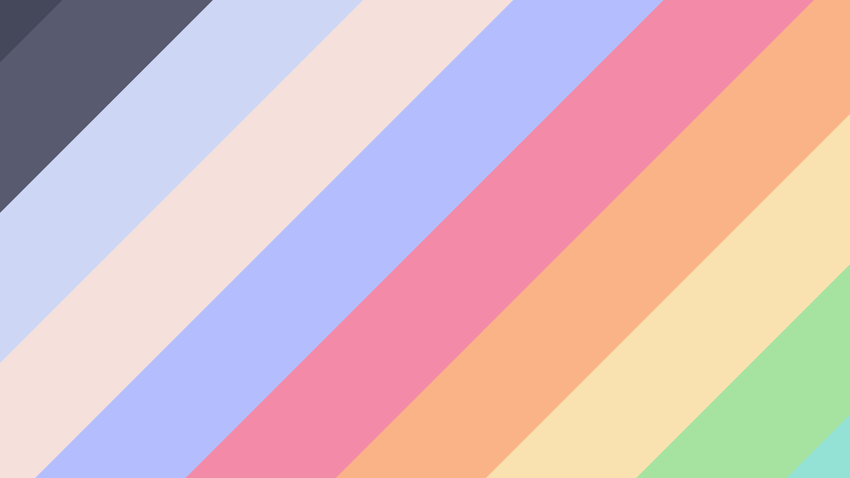 | 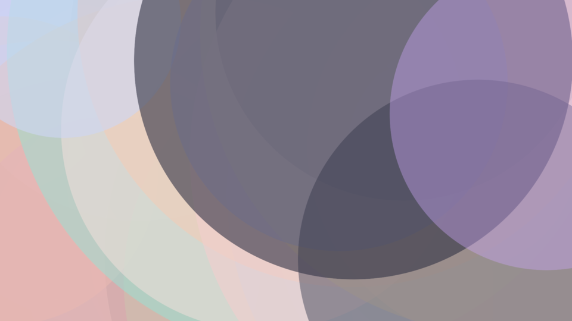 |  |
| `ascending-stripes` | `bokeh-circles` | `concentric-rings` |
| 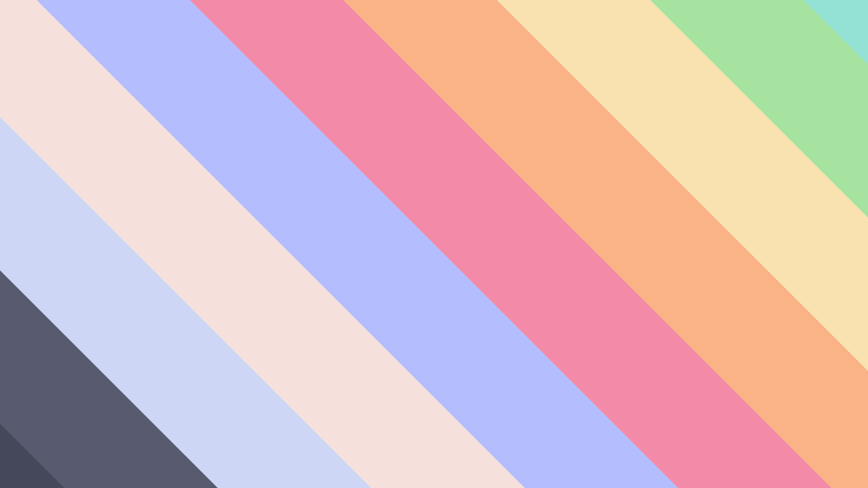 | 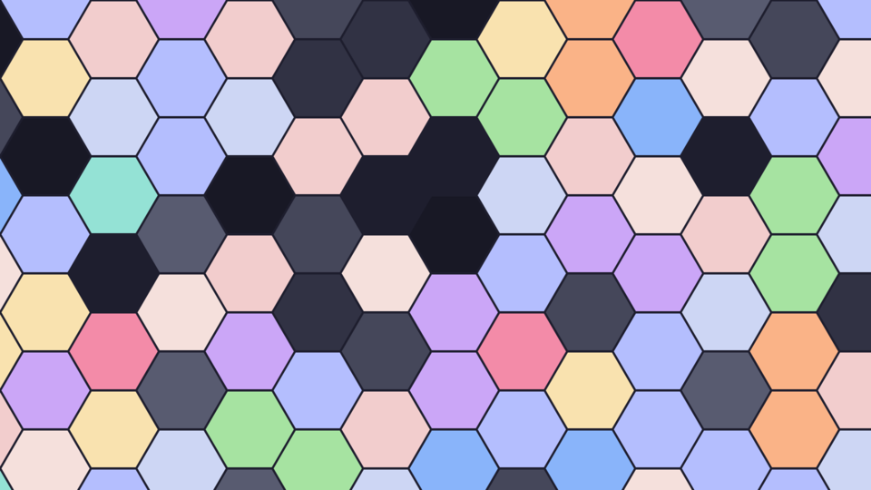 | 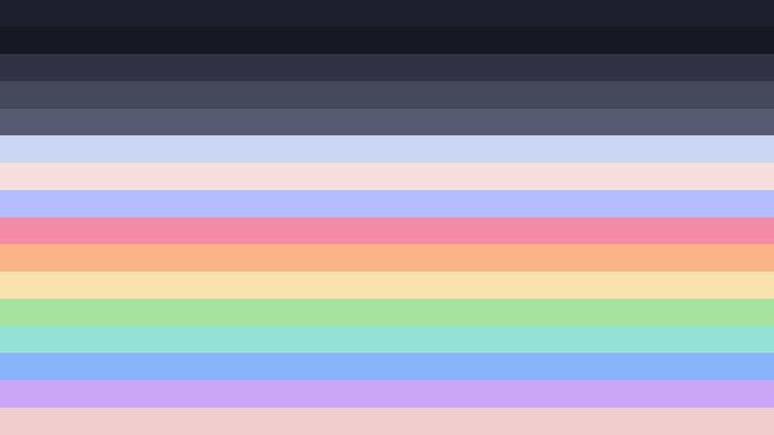 |
| `descending-stripes` | `hexagon-honeycomb` | `horizontal-stripes` |
| 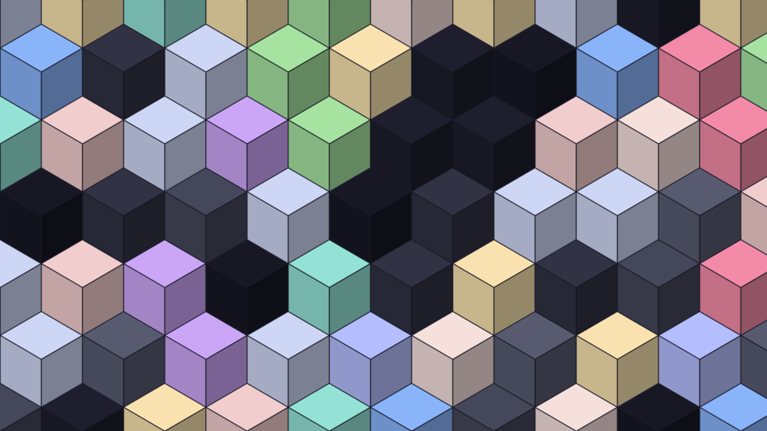 | 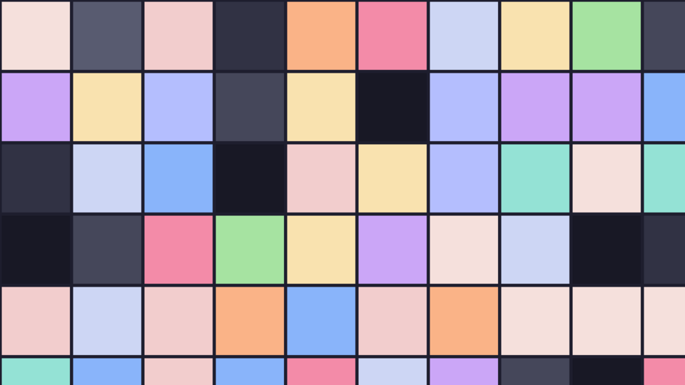 | 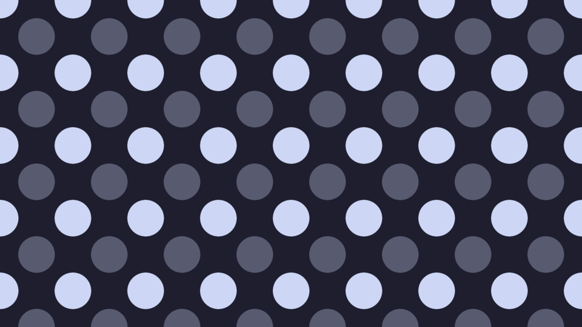 |
| `isometric-cubes` | `mosaic-tiles` | `polka-dots` |
| 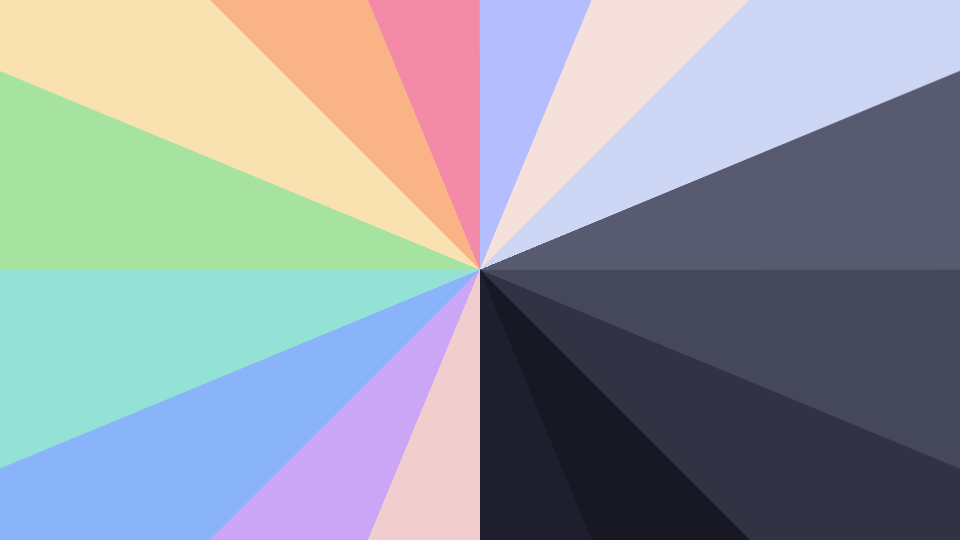 | 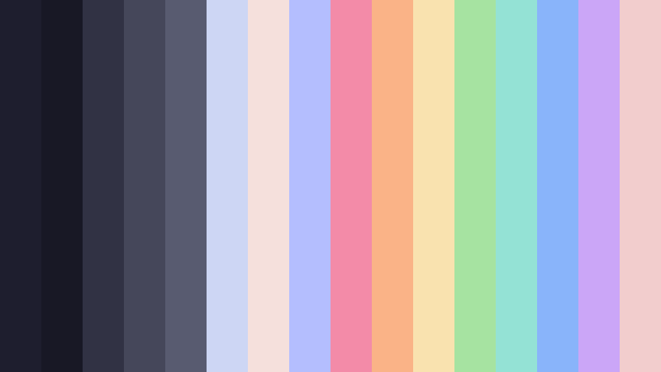 | 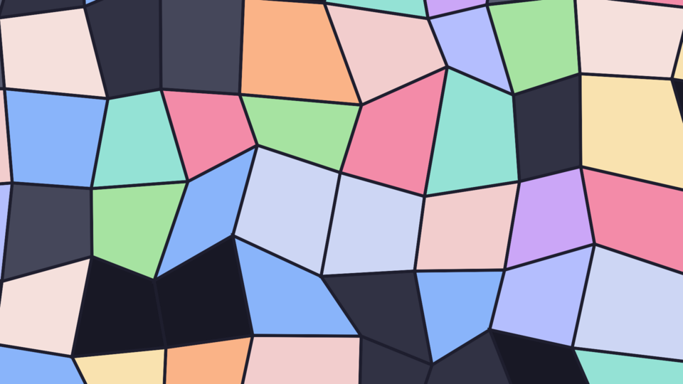 |
| `radial-burst` | `vertical-stripes` | `warped-grid` |
| 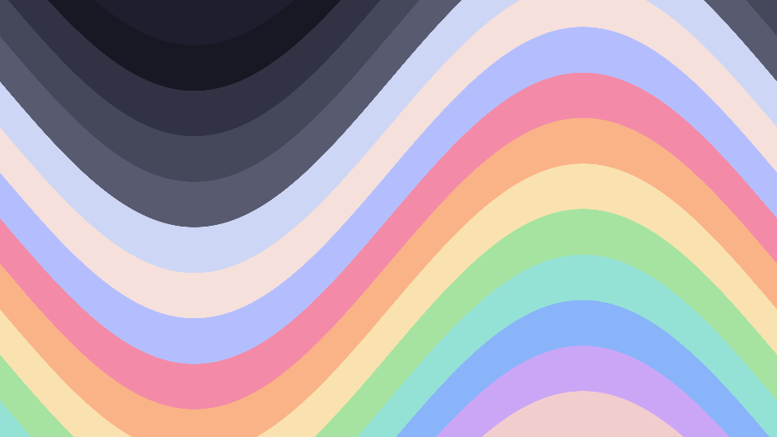 | | |
| `waves` | | |

Previews are generated at 960×540 using the default `catppuccin-mocha` palette.

## Install

There are two ways to use magickpaper.

### Nix

If you use Nix, the flake provides ImageMagick and the required shell dependencies.

Run it without installing:

```sh
nix run github:amirfarzamnia/magickpaper -- -s waves -o wallpaper.png
```

Or add it to your NixOS or Home Manager configuration:

```nix
{
  inputs = {
    nixpkgs.url = "github:nixos/nixpkgs/nixos-unstable";
    magickpaper.url = "github:amirfarzamnia/magickpaper";
  };

  outputs = { self, nixpkgs, magickpaper, ... }: {
    # In a NixOS or Home Manager module:
    # environment.systemPackages = [ magickpaper.packages.${pkgs.system}.default ];
  };
}
```

### Manual

You need:

- Bash
- ImageMagick 7+

Install ImageMagick with your package manager:

| Platform | Command |
| --- | --- |
| macOS | `brew install imagemagick` |
| Debian / Ubuntu | `sudo apt update && sudo apt install imagemagick` |
| Fedora / RHEL | `sudo dnf install ImageMagick` |
| Arch Linux | `sudo pacman -S imagemagick` |
| Windows | `winget install ImageMagick.ImageMagick` |

On Windows, run magickpaper through Git Bash or WSL and make sure ImageMagick is on `PATH`.

Check that ImageMagick is available:

```sh
magick -version
```

Then clone the repository:

```sh
# Clone the repository
git clone https://github.com/amirfarzamnia/magickpaper.git
cd magickpaper

# Make the script executable
chmod +x magickpaper.sh
```

Generate a wallpaper:

```sh
./magickpaper.sh -s waves -o wallpaper.png
```

## Usage

With Nix:

```sh
magickpaper [options]
```

From a clone:

```sh
./magickpaper.sh [options]
```

Basic syntax:

```sh
magickpaper -s <style> -p <palette> -w <width> -h <height> -o <output.png>
```

### Options

| Option | Description | Default |
| --- | --- | --- |
| `-s` | Style name from `styles/` | `vertical-stripes` |
| `-p` | Palette name from `palettes/` | `catppuccin-mocha` |
| `-w` | Width in pixels | `3840` |
| `-h` | Height in pixels | `2160` |
| `-o` | Output file | `wallpaper.png` |
| `-c` | Space-separated hex colors; overrides `-p` | — |

Images are rendered at a higher resolution and then scaled down. This gives patterns cleaner edges and smoother gradients.

### Examples

Default style and palette:

```sh
magickpaper -o wallpaper.png
```

Use a different style:

```sh
magickpaper -s waves -o wallpaper.png
```

Use a different palette:

```sh
magickpaper -s hexagon-honeycomb -p gruvbox-dark-hard -o wallpaper.png
```

Use your own colors:

```sh
magickpaper -s vertical-stripes \
  -c "#1e1e2e #313244 #cdd6da #f38ba8" \
  -o wallpaper.png
```

Generate a smaller wallpaper:

```sh
magickpaper -s bokeh-circles -w 1920 -h 1080 -o wallpaper.png
```

## Styles

Styles are shell scripts in `styles/`.

Each style receives:

- `COLORS`
- `WIDTH`
- `HEIGHT`
- `OUTPUT_FILE`
- `get_palette_expr`
- `get_clut_expr`

To add a style, create a new `styles/<name>.sh` file. No registration is needed. The filename becomes the value passed to `-s`.

## Palettes

Palettes are shell scripts in `palettes/`.

They define the standard Base16 colors:

```text
base00 ... base0F
```

The repository uses palettes from the [Base16 schemes](https://github.com/tinted-theming/schemes) collection.

## Automation

This repository uses GitHub Actions to automate routine maintenance:

- **Palette Sync (`.github/workflows/sync-palettes.yml`):** Runs weekly on a schedule to fetch the latest Base16 schemes from Tinted Theming and commits updated scripts to `palettes/`.
- **Preview Generation (`.github/workflows/generate-previews.yml`):** Automatically triggers on pushes modifying files in `styles/` or `magickpaper.sh` to update PNG previews in `previews/`.

## Development

The project uses [devenv](https://devenv.sh/) for development dependencies and tooling.

Start the development shell:

```sh
devenv shell
```

It provides ImageMagick, `yq`, `jq`, and the project's helper commands.

### Checks

The development environment also configures git hooks.

You do not need devenv to modify the project. It just provides the same tools and versions used by the project, making local development and CI more consistent.

## Contributing

Contributions are welcome.

### Adding a style

1. Add `styles/<name>.sh`.
1. Add a new entry for your style to the **Preview** table in `README.md`, keeping all styles sorted in strict alphabetical order.
1. Open a pull request with a short description of your new style.
1. GitHub Actions will automatically generate and commit the updated PNG preview image once merged.

### Other changes

For bug fixes and improvements:

1. Create a branch.
1. Make your changes.
1. Run the project's checks.
1. Use a [Conventional Commit](https://www.conventionalcommits.org/) message.
1. Open a pull request.

If you have an idea for a style, palette, or other change but are unsure whether it fits the project, open an issue first.

## License

MIT. See [LICENSE](LICENSE).
